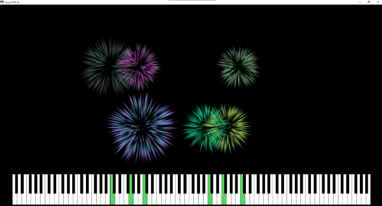

# Visual-MIDI-IN

At the moment it only supports fireworks, but I plan to add more effects in the future.

# FAQ
* Q. Can I use VSTi?
  * A. Yes. Please download [loopMIDI(Tobias Erichsen)](https://www.tobias-erichsen.de/software/loopmidi.html){:target="_blank"}.
* Q. Can I make the window go full-screen?
  * A. Yes. Please press Alt + A.
* Q. Can I load MIDI(SMF)file?
  * Sorry, it doesn't support it. Please wait until next version.